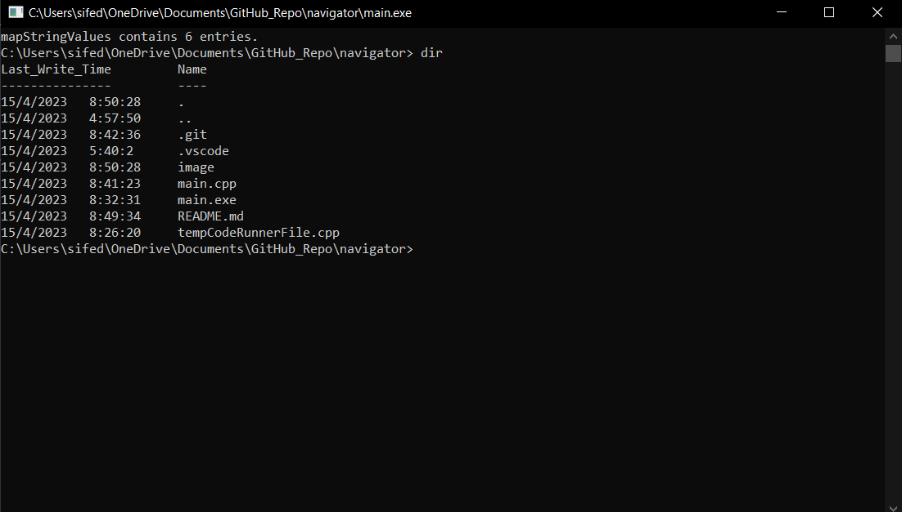

# Navigator

A simple in console file-explorer. Works only on Windows since it uses OS code.

Currently has only 7 command:

- **"dir"** lists all files and folders in a directory,

- **"cd"** is to navigate to a directory, 

- **"mkdir"** creates a folder(haven't added file creation yet),

- **"del"** deletes files/folders,

- **"open"** will externally open files. For folders it opens them in the file exporer app not in the console,

- **"touch"** is to create files.

- **"exit"** end the program.

Here is an example of the dir command being used:

